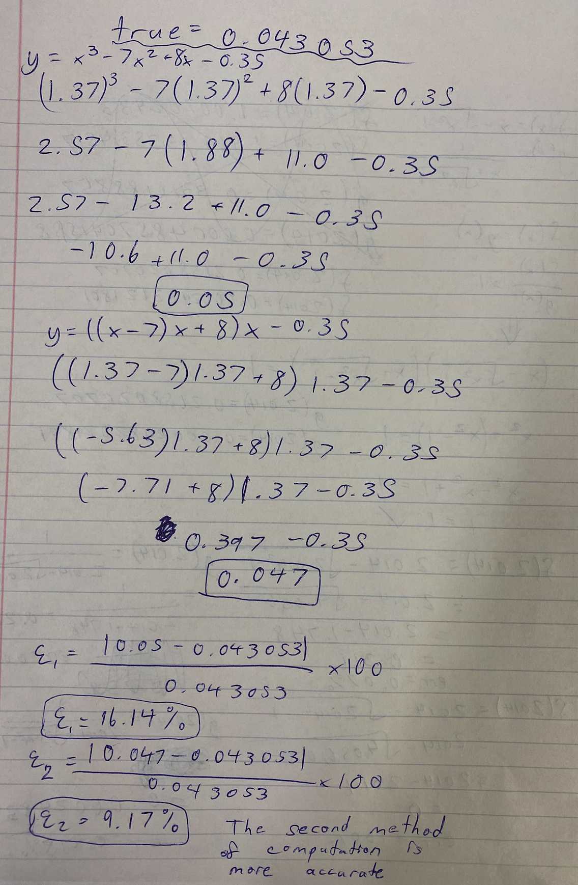

# Problem Set 1
## 1.)
```
import numpy as np

# True smallest positive real number
smallest = np.nextafter(0, 1)  # 5e-324

# True Machine Epsilon
eps = np.finfo(float).eps  # 2.220446049250313e-16

# Function to manually find Machine Epsilon


def findEps():
    prev, curr = 1, 1
    while (1 + curr) > 1:
        prev, curr = curr, curr / 2
    return prev

# Function to manually find smallest positive real number


def findSmallest():
    prev, curr = 1, 1
    while (curr - 0) != 0:
        prev, curr = curr, curr / 2
    return prev


# Assert that manual functions produce correct results
assert findEps() == eps, "Calculated machine epsilon is incorrect"
assert findSmallest() == smallest, "Calculated smallest positive \
                                real number is incorrect"

```
The results we get from running the above code is that our assertions are correct. Our calculated machine epsilon and smallest positive real number (2.220446049250313e-16 and 5e-324 respectively), match those found by explicitly querying these values in Python.

## 2.)


## 3.)


The largest relative error is produced from the calculation of f(2014). This is due to two factors. First, it is clear that g() provides a more accurate evaluation (relative to true values) when there is rounding involved. Second, the number 2014 experiences rounding in multiple steps that throws off the result. The 2014^2 step (which rounds to 4056000), the 4056000 - 1 step (which rounds to 4056000), and the (4056000)^0.5 (which rounds to 2014) result in a final expression of 0, and a relative error of 1. The rounding on numbers of greater order of magnitude gave a more inaccurate evaluation with the provided functions. The results are consistent with this conclusion as:
`Rel. Err. g(2.014) < Rel. Err. g(2014) < Rel. Err. f(2.014) < Rel. Err. f(2014)`

## 4.)
